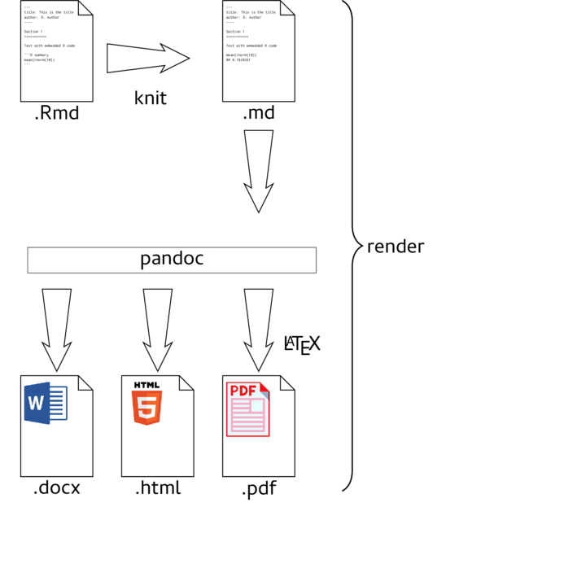
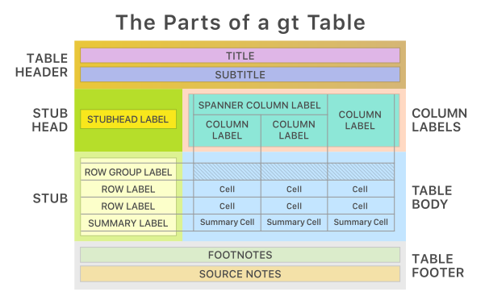
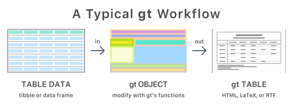

## Modül 1:

R Markdown Giriş ve R Kodlarının R Markdown İçinde Çalıştırılması

---

### R Markdown Nedir? R Markdown Nasıl Çalışır?

-   **R Markdown**, metin ve R kodunu bir araya getirerek dinamik raporlar oluşturmanızı sağlayan bir dosya formatıdır.
-   **Çalışma Prensibi:**
    -   Metin ve kod blokları bir arada bulunur.
    -   Kod blokları çalıştırılarak çıktılar doğrudan dokümana eklenir.
    -   Sonuçta, analiz ve raporlama süreçleri entegre edilir.

---

### .Rmd Dosyasının İçeriği Nedir?

-   **YAML Başlığı:**
    -   Başlık, yazar, tarih ve çıktı formatı gibi meta verileri içerir.
-   **Metin Bölümleri:**
    -   Markdown dilini kullanarak biçimlendirilmiş açıklamalar ve analizler.
-   **Kod Blokları:**
    -   R kodunun çalıştırıldığı ve çıktılarının görüntülendiği bölümler.

---

### ArkaPlan

```{r}

# Other option 
# {width="50%"}
```


---

### R Markdown Hangi Belge Formatlarını Destekler?

-   **HTML:** Web tabanlı, etkileşimli içerik oluşturma.
-   **PDF:** Yüksek kaliteli, yazdırılabilir belgeler.
-   **Word:** Microsoft Word ile uyumlu düzenlenebilir dokümanlar.
-   **Sunumlar:** ioslides, Beamer gibi formatlarla slaytlar oluşturma.

---

### .Rmd Dosyaları için Çalışma Ortamı Hazırlama

-   **Gerekli Yazılımlar:**
    -   **R:** İstatistiksel hesaplama ve grafikler için.
    -   **RStudio:** R için entegre geliştirme ortamı.
-   **Kurulum Adımları:**
    -   R ve RStudio'yu resmi sitelerinden indirip yükleyin.
    -   RStudio'da yeni bir R Markdown dosyası oluşturun ve gerekli paketleri yükleyin.

---

### R, R Studio ve Gerekli Kütüphanelerin Kurulması

-   **R ve RStudio Kurulumu:**
    -   [CRAN](https://cran.r-project.org/) üzerinden R'yi indirin ve yükleyin.
    -   [RStudio](https://www.rstudio.com/products/rstudio/download/) üzerinden RStudio'yu indirin ve yükleyin.
-   **Gerekli Kütüphanelerin Yüklenmesi:**
    -   RStudio'da aşağıdaki komutları çalıştırarak gerekli paketleri yükleyin:

        ``` r
        install.packages(c("rmarkdown", "knitr"))
        ```

---

### Metin içi Temel Tasarım ve Metin Organizasyonu

-   **Başlıklar:**
    -   `#` ile ana başlık, `##` ile alt başlıklar oluşturulur.
-   **Listelemeler:**
    -   `-` veya `*` ile madde işaretli listeler.
    -   `1.` ile numaralı listeler.
-   **Vurgulamalar:**
    -   *İtalik* için `*metin*` veya `_metin_`.
    -   **Kalın** için `**metin**` veya `__metin__`.

---

### Formatting Text in R Markdown

-   **Headers:**
    -   `#` for H1
    -   `##` for H2
    -   `###` for H3, and so on.
-   **Emphasis:**
    -   *Italic:* `*italic*` or `_italic_`
    -   **Bold:** `**bold**` or `__bold__`
    -   ***Bold Italic:*** `***bold italic***`
-   **Lists:**
    -   **Unordered:** Use `-`, `*`, or `+` followed by a space.
    -   **Ordered:** Use numbers followed by a period, e.g., `1.`, `2.`

---

### Visual Markdown Editor

-   **Purpose:** Provides a what you see is what you get (WYSIWYG) interface for editing R Markdown documents.

-   **Features:**

    -   Real-time rendering of Markdown content.
    -   Toolbar for common formatting options.
    -   Easier insertion of images, links, and tables.

-   **Accessing in RStudio:**

    -   Click the visual editor button in the toolbar or press `Ctrl+Shift+F4` (Windows/Linux) or `Cmd+Shift+F4` (Mac).

---

### R Kod Bloklarının Kullanımı

-   **Kod Blokları:**
    -   Üç tırnak işareti ve `{r}` ile başlayan ve üç tırnak ile biten bloklar:

        ```{{r}}
        # R kodu buraya
        ```
-   **Kod Blokları Seçenekleri:**
    -   `echo=FALSE`: Kodu gizler, sadece çıktıyı gösterir.
    -   `eval=FALSE`: Kodu çalıştırmaz, sadece gösterir.
    -   `include=FALSE`: Kodu ve çıktıyı gizler, ancak çalıştırır.

---

### Code Chunks in R Markdown

-   **Definition:** Sections of the document that contain executable code.

-   **Syntax:**

    ```{r chunk-name}
    # Your R code here
    ```

-   **Chunk Name:** Optional but useful for reference.

-   **Languages Supported:** R, Python, SQL, and more.

---

### Code Chunk Options

-   **Purpose:** Control the behavior and appearance of code chunks.

-   **Common Options:**

    -   `echo`: Display code in the output (`TRUE`/`FALSE`).
    -   `eval`: Evaluate the code (`TRUE`/`FALSE`).
    -   `include`: Include both code and output in the document (`TRUE`/`FALSE`).
    -   `message` and `warning`: Display messages and warnings (`TRUE`/`FALSE`).
    -   `fig.width` and `fig.height`: Set figure dimensions (in inches).
    -   `error` TRUE (display error messages in doc) - FALSE (stop render when error occurs)
    -   `warning` display code warnings in document (`TRUE`/`FALSE`)

-   **Example:**

```{r, echo=FALSE, fig.width=6, fig.height=4}
# Your R code here
```

---

### Code Chunk Options notes

-   Hide code using 'echo=FALSE'

-   Hide output using 'eval=FALSE'

-   ...

Buradan faydalanmakta fayda var: [Chunk options and package options](https://yihui.org/knitr/options/)

---

### Setting Global Code Chunk Options

-   **Purpose:** Apply consistent settings across all code chunks.

-   **Method:** Set options in a setup chunk at the beginning of the document.

-   **Example:**

```{r setup, include=FALSE}
# knitr::opts_chunk$set(echo = TRUE, warning = FALSE, message = FALSE)
```

-   **Benefit:** Simplifies management of chunk behaviors and appearance.

---

## Egzersiz: `mtcars` Veri Seti Üzerinde Farklı Kod Bölümü Seçenekleri Kullanma
  
**Soru:**  
R Markdown kullanarak, `mtcars` veri setindeki `mpg` (galon başına mil) ve `hp` (beygir gücü) değişkenlerinin dağılımını gösteren bir histogram oluşturun. Kod bölümünde (`code chunk`) aşağıdaki seçenekleri kullanın:
  
- `echo = TRUE`: Kodun çıktıda görünmesini sağlayın.
- `fig.width = 8` ve `fig.height = 6`: Grafiğin boyutlarını ayarlayın.
- `message = FALSE` ve `warning = FALSE`: Uyarı ve mesajların çıktıda görünmesini engelleyin.

---

### Inline Code in R Markdown

-   **Purpose:** Embed R code within text for dynamic reporting.

-   **Example:**

    -   Markdown: \`The current date is\
    
        ```{{r}}
        Sys.Date()
        ```
        
    -   Output: The current date is `r Sys.Date()`.

-   **Use Cases:**

    -   Displaying dynamic values like dates, statistics, or results within narrative text.

---

### Practical Example of Inline Code

-   **Scenario:** Reporting the mean of a dataset.

-   **R Code:**

```{r}
  data <- c(5, 10, 15, 20)
  mean_value <- mean(data)
```

-   **Inline Usage:**
    -   Markdown: `The mean of the dataset is`r mean_value`.`
    -   Output: The mean of the dataset is `r mean_value`.
-   **Advantage:** Ensures that reported values are always up-to-date with the underlying data and analysis.

---

### Math Expressions

-   Inline LaTeX equations can be written in a pair of dollar signs using the LaTeX syntax

-   It is possible to use math environments inside \$ \$ or $$  $$

-   Certain Latex related Math expressions are possible to create ie.

$$\begin{array}{ccc}
x_{11} & x_{12} & x_{13}\\
x_{21} & x_{22} & x_{23}
\end{array}$$

---

## Other Programming Languages

- A less well-known fact about R Markdown is that many other languages are also supported, such as Python, Julia, C++, and SQL

- The support comes from the knitr package, which has provided a large number of language engines

- You can list the names of all available engines via: 

```{r}
names(knitr::knit_engines$get())[1:10]
```


--- 

## Simple Python Example 

```{python}
# library(reticulate)
# x = 'hello, python world!'
# print(x.split(' '))
```


- The python engine is based on the reticulate package (Ushey, Allaire, and Tang 2023), which makes it possible to execute all Python code chunks in the same Python session

- If you actually want to execute a certain code chunk in a new Python session, you may use the chunk option 

```{r eval=FALSE, include=FALSE}
# `python.reticulate = FALSE`
```


---

## Insert Citations (Kaynakca)

-   Create citations from a bibliography file, a Zotero library, or from DOI references, by adding the following details on the YAML header

> bibliography: references.bib 
link-citations: TRUE
>

-   If you are using Zotero, your main library will automatically be available.

-   Add citations by DOI by searching "from DOI" in the Insert Citation dialog.

- Within your document, cite sources using the citation key from your .bib file by writing [@cite] or @cite in the text. 

- If you are using the Visual Editor, by clicking the @ symbol in the toolbar or by clicking `Insert > Citation`

--- 

## More Header Options

- Parameterize your documents to reuse with new
inputs, by adding in the header as sub-values of params.

- REUSABLE TEMPLATES are possible, via new package creation that includes template.yaml. In this case, it is possible to install the package to access template by going to File > New R Markdown > From Template


- Customize HTML documents with Bootswatch
themes from the bslib package using the theme
output option (Use bslib::bootswatch_themes() to list available
themes)

- Customize individual HTML elements using bslib variables. Use `?bs_theme` to see more variables.

- Add CSS and SCSS to your document by adding a
path to a file with the css option in the YAML header

---

## How to add a Table of Contents?

- To include a Table of Contents (TOC) in your R Markdown document, modify the YAML header as follows:
  - `toc: true`: Enables the Table of Contents.
  - `toc_depth: 2`: Sets the depth of headers included in the TOC (levels 1 and 2).
  - `toc_float: true`: For a floating TOC that remains visible as you scroll
  - `collapsed (defaults to TRUE)` controls whether the TOC appears with only the top-level (e.g., H2) headers. If collapsed initially, the TOC is automatically expanded inline when necessary.
  - `smooth_scroll (defaults to TRUE)` controls whether page scrolls are animated when TOC items are navigated to via mouse clicks.

- You can add section numbering to headers using the number_sections

--- 

## Creating Tables in R Markdown

-   **Markdown Syntax:** For simple tables.
-   **`knitr::kable()`:** For enhanced formatting.
-   **`kableExtra` Package:** For advanced customization.
-   **`gt` Package:** For complex and aesthetically pleasing tables.

--- 

### Basit Tablo Oluşturma

-   **Markdown ile Tablo:**
    -   Sütun başlıkları ve altına `---` çizgileri ile tablo oluşturulur:

        ```         
        | Sütun 1 | Sütun 2 |
        |---------|---------|
        | Veri 1  | Veri 2  |
        ```

    -   *Note:* Markdown tables are limited in styling and functionality.
-   **R Koduyla Tablo:**
    -   `knitr` paketinin `kable` fonksiyonu kullanılır:

        ``` r
        knitr::kable(iris[1:5, ], caption = "İlk 5 iris verisi")
        ```
--- 

## Enhanced Tables with `knitr::kable()`

-   **Function:** Converts data frames or matrices into markdown tables.

-   **Syntax:**

```{r}
knitr::kable(data, caption = "Table Caption")

# Sample data
df <- data.frame(
  Name = c("John", "Alice"),
  Age = c(25, 30)
)
# Create table
knitr::kable(df, caption = "Sample Table")

```

**Important:** kable() provides a simple way to format tables but has limited styling options.

--- 

## Introduction to `knitr::kable()`

-   **Purpose:** Generate simple and elegant tables in R Markdown documents.
-   **Supported Formats:**
    -   LaTeX
    -   HTML
    -   Markdown
    -   reStructuredText
-   **Basic Syntax:**

```{r, eval=FALSE}
knitr::kable(x, format, digits = getOption("digits"), row.names = NA, col.names = NA, align, caption = NULL, label = NULL, format.args = list(), escape = TRUE, ...)
```

--- 

### Basic Table with kable

```{r}
# Load necessary library
library(knitr)

# Sample data frame
df <- data.frame(
  Item = c("Apple", "Banana", "Cherry"),
  Quantity = c(10, 5, 20),
  Price = c(0.5, 0.3, 0.8)
)

# Generate table
kable(df, caption = "Fruit Inventory")

```

--- 

### Formatting options

-   Digits: Control the number of decimal places.

```{r}
kable(df, digits = 2)

```

--- 

-   Column Names: Customize column headers.

```{r}
kable(df, col.names = c("Fruit", "Count", "Unit Price"))

```

--- 

-   Alignment: Set column alignment ('l', 'c', 'r').

```{r}
kable(df, align = 'c')

```

--- 

### Advanced Tables with kableExtra

Purpose: Extend kable() with additional styling and formatting capabilities

```{r}
library(kableExtra)
knitr::kable(data) %>%
  kable_styling()

# Sample data
df <- data.frame(
  Name = c("John", "Alice"),
  Age = c(25, 30)
)
# Create styled table
knitr::kable(df, caption = "Styled Table") %>%
  kable_styling(bootstrap_options = "striped", full_width = F)

```

Note: kableExtra allows for extensive customization, including adding stripes, borders, and more.

--- 

### Example of kable_styling() Function

```{r}
# Basic table with styling
kable(df, caption = "Styled Table") %>%
  kable_styling(bootstrap_options = c("striped", "hover"), 
                full_width = F, 
                position = "center", 
                font_size = 14)

```

--- 

### Example on Column Specification

```{r}
# Highlight 'Quantity' column
kable(df, caption = "Column Specification") %>%
  kable_styling(full_width = F) %>%
  column_spec(2, bold = TRUE, color = "white", background = "dodgerblue")

```

--- 

### Example on Row specification

```{r}
kbl(df) %>%
  column_spec(2, bold = TRUE, color = "white", background = "dodgerblue") %>%
  row_spec(1, bold = T, color = "white", background = "#D7261E")
```


---

### Example on Cell/Text Specification

```{r}
# Apply cell_spec to format the 'Age' column
df$Age <- cell_spec(df$Age, color = ifelse(df$Age > 25, "red", "blue"))

# Create the table with kable and kable_styling
kbl(df, escape = FALSE, caption = "Cell/Text Specification Example") %>%
  kable_paper("striped", full_width = FALSE)
```


--- 

### Example on Table Footnote

```{r}
# Table with footnote
# Create the table with kable and kable_styling
kable(df, caption = "Table with Footnote") %>%
  kable_styling(full_width = F) %>%
  footnote(general = "Prices are in USD.", 
           general_title = "Note:", 
           footnote_as_chunk = TRUE)

```

--- 

## Egzersiz 3: `kableExtra` ile Gelişmiş Tablo Oluşturma

**Soru:**  
`knitr` paketindeki `kable` fonksiyonunu kullanarak, `mtcars` veri setinin ilk 10 satırını gösteren bir tablo oluşturun. Tabloyu, satırların dönüşümlü olarak farklı renklerde olması, başlığın kalın yazılması ve tablonun başlığı olarak "mtcars Veri Setinin İlk 10 Satırı" ifadesinin eklenmesiyle zenginleştirin.

---

## Introduction to the `officer` Package

- **Purpose:** Facilitates the creation and manipulation of Microsoft Word (`.docx`) and PowerPoint (`.pptx`) documents directly from R.
- **Key Features:**
  - Add text, images, tables, and plots to documents.
  - Customize document styles and layouts.
  - Automate report generation.

--- 

### Creating a new word doc in R 

```{r}
# Load the officer package
library(officer)

# Create a new Word document
doc <- read_docx()
# Add a title
doc <- body_add_par(doc, "Introduction to the officer Package", style = "heading 1")

# Add a paragraph of text
doc <- body_add_par(doc, "The officer package allows R users to generate Word documents programmatically.", style = "Normal")

# Save the document
print(doc, target = "officer_intro.docx")

```


---

### Adding a Table 

```{r}
# Sample data frame
df <- data.frame(
  Name = c("Alice", "Bob", "Charlie"),
  Score = c(85, 92, 78)
)

# Add a table to the document
doc <- body_add_table(doc, value = df, style = "table_template")

# Save the document
print(doc, target = "officer_intro.docx")
```

--- 

### Overview 

- There are similar functions to work on ppt files 

- The officer package provides a powerful interface to create and manipulate Word and PowerPoint documents directly from R.

- It enables automation of report generation, ensuring reproducibility and efficiency.

- By integrating officer into your R workflow, you can produce dynamic and customizable documents tailored to your needs.

--- 

### Creating Tables with gt

-   Markdown Tables: Quick and simple but limited in styling.

-   knitr::kable(): Enhances basic tables with minimal effort.

-   kableExtra: Provides advanced styling options for kable tables.

-   gt: Ideal for creating complex and visually appealing tables.

--- 

## Overview on gt R package

{width="80%"}
---

## Workflow of gt 

{width="70%"}

---

### gt Package Examples

```{r}
library(gt)

# Sample data frame
data <- data.frame(
  Item = c("Apple", "Banana", "Cherry"),
  Quantity = c(10, 5, 20),
  Price = c(0.5, 0.3, 0.2)
)

# Create gt table
gt_table <- gt(data)
gt_table
```

---

### Adding a Title and Subtitle

```{r}
gt_table <- gt(data) %>%
  tab_header(
    title = "Fruit Inventory",
    subtitle = "Current stock and pricing"
  )
gt_table
```

---

### Formatting Columns

```{r}
gt_table <- gt(data) %>%
  fmt_currency(
    columns = vars(Price),
    currency = "USD"
  ) %>%
  fmt_number(
    columns = vars(Quantity),
    decimals = 0
  )
gt_table
```

---

### Adding Footnotes


```{r}
gt_table <- gt(data) %>%
  tab_footnote(
    footnote = "Prices are per unit.",
    locations = cells_column_labels(columns = vars(Price))
  )
gt_table
```

---

### Highlighting Cells


```{r}
gt_table <- gt(data) %>%
  tab_style(
    style = cell_fill(color = "lightgreen"),
    locations = cells_body(
      columns = vars(Quantity),
      rows = Quantity > 15
    )
  )
gt_table
```

---

### Grouping Rows

```{r}
data_grouped <- data.frame(
  Category = c("Fruit", "Fruit", "Berry"),
  Item = c("Apple", "Banana", "Cherry"),
  Quantity = c(10, 5, 20)
)

gt_table <- gt(data_grouped) %>%
  tab_row_group(
    label = "Fruits",
    rows = Category == "Fruit"
  ) %>%
  tab_row_group(
    label = "Berries",
    rows = Category == "Berry"
  )
gt_table

```

---

### Adding Summary Rows

```{r}
gt_table <- gt(data) %>%
  summary_rows(
    groups = NULL,
    columns = vars(Quantity, Price),
    fns = list(
      Total = ~sum(.),
      Average = ~mean(.)
    )
  )
gt_table
```

---

### Saving the Table

```{r}
gtsave(gt_table, "fruit_inventory.html")

```

---

## Egzersiz 1: `gt` Paketi ile `mtcars` Verisini Özetleme

**Soru:**  
`gt` paketini kullanarak, `mtcars` veri setindeki `mpg` (galon başına mil) ve `hp` (beygir gücü) sütunlarının ortalama, medyan ve standart sapmalarını gösteren bir tablo oluşturun. Tabloya uygun sütun başlıkları ekleyin ve sayısal değerleri iki ondalık basamak olacak şekilde biçimlendirin.

---

### gtsummary use cases - kullanım

-   **Purpose:** Create publication-ready summary and analytical tables in R.
-   **Key Features:**
    -   Summarize data frames with descriptive statistics.
    -   Present regression model results.
    -   Highly customizable with sensible defaults.

--- 

### Creating a Summary Table with tbl_summary()

```{r}
# Load necessary library
library(gtsummary)

# Sample data frame
df <- data.frame(
  Treatment = c("Drug A", "Drug B", "Drug A", "Drug B"),
  Age = c(45, 50, 38, 60),
  Response = c("Yes", "No", "Yes", "No")
)

# Generate summary table
gtsummary::tbl_summary(df)

```

--- 

### Adding P-values with add_p()

```{r}
# Generate summary table with p-values
tbl_summary(df, by = Treatment) %>%
  add_p()

```

--- 

### Customizing Tables with Themes

```{r}
# Set gtsummary theme
set_gtsummary_theme(theme_gtsummary_journal())

# Generate themed summary table
tbl_summary(df)

```

--- 

### Reporting Statistics Inline with inline_text()

```{r}
# Generate summary table
tbl <- tbl_summary(
  df,
  statistic = list(
    all_continuous() ~ "{mean} ({sd})",
    all_categorical() ~ "{n} / {N} ({p}%)"
  )
)
tbl

```

--- 

### Another Example 

```{r}
head(trial)
trial2 <- trial |> select(trt, age, grade)
trial2 |> tbl_summary()
```

--- 

### Extracting the median 

```{r}
# Extract median age for Drug A
tab1 <- tbl_summary(trial2, by = trt)
tab1

```


```{r}
# The median (IQR) marker level in the Drug A and Drug B groups are 
# `r inline_text(tab1, variable = Age, column = "Drug A")` and 
# `r inline_text(tab1, variable = Age, column = "Drug B")`, respectively.
```


--- 

### Displaying Regression Model Results with tbl_regression()

```{r}
# Load necessary library
library(gtsummary)

# Sample data
data <- data.frame(
  Outcome = c(1, 0, 1, 0),
  Predictor = c(2.3, 1.9, 3.1, 2.8)
)

# Fit a logistic regression model
model <- glm(Outcome ~ Predictor, data = data, family = binomial)

# Generate regression summary table
tbl_m1 <- tbl_regression(model)
tbl_m1 

tbl_m1 <- tbl_regression(model, exponentiate = TRUE)
tbl_m1 

```

Text içinde raporlamak adına;
 
`r inline_text(tbl_m1, variable = Predictor)`

--- 

## Egzersiz 2: `gtsummary` ile Gruplandırılmış Özet Tablosu

**Soru:**  
`gtsummary` paketini kullanarak, `mtcars` veri setinde silindir sayısına (`cyl`) göre gruplandırılmış ve `mpg`, `hp` ve `wt` (ağırlık) değişkenleri için tanımlayıcı istatistikleri içeren bir özet tablo oluşturun. Uygun etiketler ekleyin ve her değişken için medyan ve çeyrekler arası aralığı gösterin.

---

### Baska neler var ?

```{r}
knitr::include_graphics("img/gt_tables.png")
# Other option 
# {width="50%"}
```

--- 

### About `flextable` Package

-   **Purpose:** Create customizable and publication-ready tables in R.
-   **Key Features:**
    -   Supports multiple output formats: HTML, Word, PDF, PowerPoint.
    -   Allows detailed formatting of table content and appearance.

--- 

### Overview of packages

```{r, echo=FALSE}
# Load necessary libraries
library(knitr)
library(kableExtra)

# Create a data frame summarizing the packages
table_data <- data.frame(
  Package = c("gt", "gtsummary", "flextable", "kable"),
  Pros = c(
    "User-friendly syntax for creating complex tables; supports advanced formatting, including footnotes and spanning headers; integrates seamlessly with R Markdown for HTML reports.",
    "Designed for summarizing statistical analyses, particularly in medical research; provides functions for summarizing data frames and regression models; compatible with multiple output formats through integration with other packages.",
    "Versatile support for multiple output formats, including HTML, LaTeX, Word, and PowerPoint; offers detailed control over table appearance, such as cell formatting and merging; ideal for creating tables in Word and PowerPoint documents.",
    "Simple and straightforward syntax for basic tables; supports both HTML and LaTeX outputs; integrates well with R Markdown for basic table creation."
  ),
  Cons = c(
    "Limited to HTML output; lacks support for LaTeX and Word formats; may require additional customization for specific formatting needs.",
    "Primarily focused on summary statistics; less flexible for general table creation; relies on other packages (e.g., `gt`, `flextable`) for rendering outputs in various formats.",
    "Learning curve due to extensive customization options; may require more code for simple tables compared to other packages.",
    "Limited customization options without additional packages like `kableExtra`; may not handle complex table structures or formatting needs effectively."
  )
)

# Generate the table using kable
kable(table_data, format = "html", escape = FALSE, caption = "Comparison of R Table Packages") %>%
  kable_styling(full_width = FALSE, bootstrap_options = c("striped", "hover", "condensed", "responsive"))

```


--- 

### Rmd Tips and Tricks

-   If you do not want a certain heading to be numbered, you can add {-} or {.unnumbered} after the heading,

```{r}
# Preface {-}
```

-   Unordered list items start with \*, -, or +, and you can nest one list within another list by indenting the sub-list, e.g.,

-   one item

    -   one more item

-   Block quotes are written after \>, e.g.

> Welcome to our course
>
> --- Ozan Evkaya

- To add an image to an RMarkdown file you can use the following markdown syntax: 

```{r eval=FALSE, include=FALSE}
#  
```

- Make sure that you are not using the same code chunk name as duplication, that creates an error !

- Make sure that after the : operator in your YAML header for further customization you are adding a space 

---

## Ek sorular

**Egzersiz: `gt` ile Koşullu Biçimlendirme**

`gt` paketini kullanarak, `mtcars` veri setinden `mpg` değeri 25'ten büyük olan satırları vurgulayan bir tablo oluşturun. Bu satırlara açık yeşil bir arka plan rengi uygulayın ve tabloya uygun sütun başlıkları ekleyin.

**Egzersiz: `gtsummary` ile Regresyon Özeti**

`mtcars` veri setini kullanarak, `mpg`'yi `hp` ve `wt` değişkenlerine göre tahmin eden bir doğrusal regresyon modeli oluşturun. `gtsummary` paketini kullanarak, regresyon sonuçlarını, güven aralıklarını ve p-değerlerini içeren bir özet tablo oluşturun.


